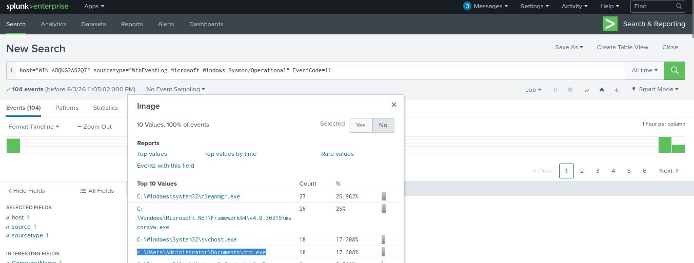
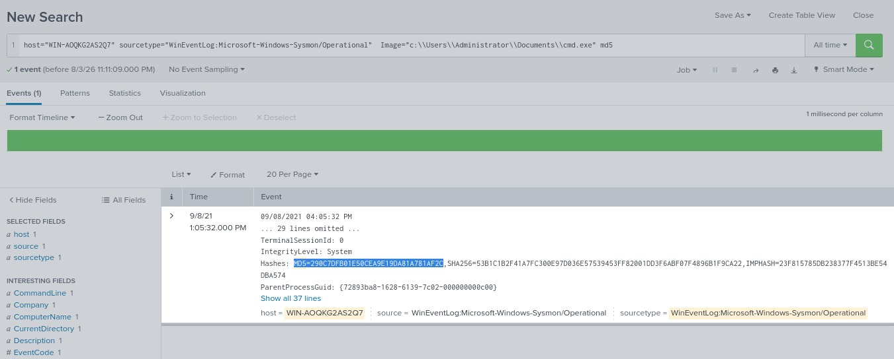
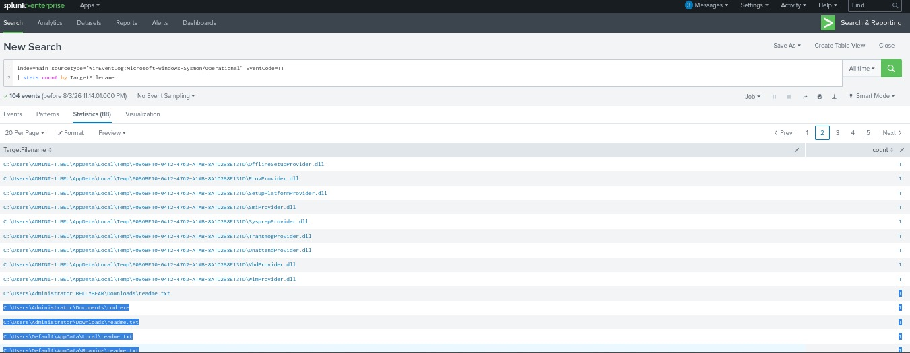
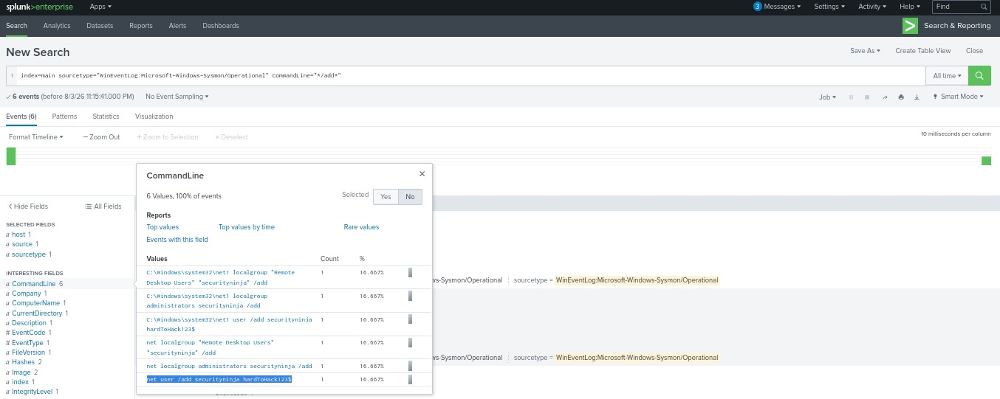
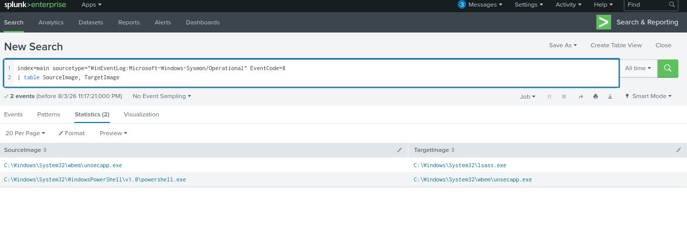
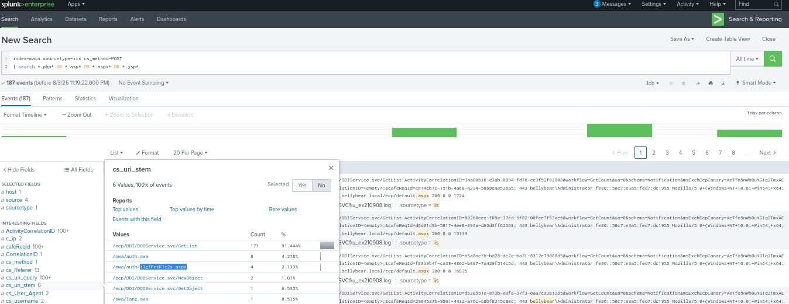
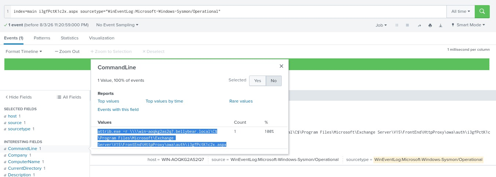

# Splunk Queries

This document contains the Splunk Search Processing Language (SPL) queries used during the investigation of a simulated Conti ransomware attack. Each query includes its objective, observation, SOC analyst finding, and supporting evidence.

---

# Query 1 – Processes Creating Files

## Purpose

Identify processes responsible for creating files on the compromised system.

### SPL Query

```spl
index=main sourcetype="WinEventLog:Microsoft-Windows-Sysmon/Operational" EventCode=11
```

### Observation

- Reviewed Sysmon Event ID 11.
- Analyzed the **Image** field to identify processes creating files.
- Most entries were legitimate Windows processes, while one executable was observed running from an unusual location.

### SOC Analyst Finding

The file creation events provided the initial evidence required to continue the investigation and identify suspicious process activity.

**Screenshot:**



---

# Query 2 – Malicious File Hash

## Purpose

Retrieve the cryptographic hash of the suspicious executable.

### SPL Query

```spl
index=main sourcetype="WinEventLog:Microsoft-Windows-Sysmon/Operational" Image="C:\Users\Administrator\Documents\cmd.exe"
```

### Observation

- Retrieved the SHA256 hash of the suspicious executable.
- The extracted hash can be used as an Indicator of Compromise (IOC).

### SOC Analyst Finding

The SHA256 hash can be correlated with threat intelligence platforms to determine whether the executable has been previously identified as malicious.

**Screenshot:**



---

# Query 3 – Ransom Note Detection

## Purpose

Identify ransomware note creation on the compromised host.

### SPL Query

```spl
index=main sourcetype="WinEventLog:Microsoft-Windows-Sysmon/Operational" EventCode=11
| stats count by TargetFilename
```

### Observation

- Multiple **README.txt** files were identified.
- File creation events indicate ransomware execution.

### SOC Analyst Finding

The creation of ransom notes confirms successful ransomware execution on the compromised system.

**Screenshot:**



---

# Query 4 – Suspicious User Creation

## Purpose

Detect unauthorized local user account creation.

### SPL Query

```spl
index=main sourcetype="WinEventLog:Microsoft-Windows-Sysmon/Operational" CommandLine="*/add*"
```

### Observation

A suspicious command was identified:

```cmd
net user /add securityninja hardToHack123$
```

### SOC Analyst Finding

The attacker established persistence by creating a new local user account.

**Screenshot:**



---

# Query 5 – Process Injection

## Purpose

Identify process injection activity.

### SPL Query

```spl
index=main sourcetype="WinEventLog:Microsoft-Windows-Sysmon/Operational" EventCode=8
| table SourceImage TargetImage
```

### Observation

Observed the following process execution chain:

- powershell.exe
- unsecapp.exe
- lsass.exe

### SOC Analyst Finding

The observed process chain is consistent with process injection and possible credential access techniques.

**Screenshot:**



---

# Query 6 – Web Shell Detection

## Purpose

Identify suspicious web shell activity using IIS logs.

### SPL Query

```spl
index=main sourcetype=iis cs_method=POST
| search *.php* OR *.asp* OR *.aspx* OR *.jsp*
```

### Observation

Suspicious HTTP POST requests targeting an ASPX file were identified.

### SOC Analyst Finding

The IIS logs indicate potential web shell activity on the Microsoft Exchange Server.

**Screenshot:**



---

# Query 7 – Web Shell Verification

## Purpose

Verify the presence of the identified web shell.

### SPL Query

```spl
index=main i3gfPctK1c2x.aspx
```

### Observation

The suspicious ASPX file was successfully identified during the investigation.

### SOC Analyst Finding

The identified web shell confirms unauthorized access to the Microsoft Exchange Server and supports the attack timeline reconstruction.

**Screenshot:**


